# Automação de VPN Site-to-Site – Fortigate x Palo Alto

Este projeto automatiza a criação de uma VPN IPsec **site-to-site** entre um **Fortigate** (Ponta A) e um **Palo Alto** (Ponta B), usando **Python** e chamadas de API REST/XML.

A aplicação possui:

- **Interface gráfica (Tkinter)** para preencher os parâmetros da VPN  
- Arquivo de configuração em **YAML** (`config/vpn_params_example.yaml`)  
- Dois scripts separados que aplicam a configuração em cada firewall:  
  - `scripts/configure_vpn_fortigate.py`  
  - `scripts/configure_vpn_paloalto.py`  

> 🔎 **Nota:** Esta automação foi desenvolvida com auxílio de uma IA da **OpenAI** (modelo GPT-5.1 Thinking), refinindo scripts, lógica de API e interface.

---

## 1. Requisitos

### 1.1. Ambiente

- Python **3.9+** (recomendado)
- Acesso de rede aos firewalls:
  - Fortigate (FortiOS 7.6.2) - HTTPS + API REST habilitada
  - Palo Alto (PanOS 10.0.0) - API XML/REST habilitada
- Credenciais / chaves:
  - **Fortigate**: token de API com permissão de escrita  
  - **Palo Alto**: **API Key** com permissão de configuração e commit  

### 1.2. Bibliotecas Python

Bibliotecas utilizadas:

- [requests](https://pypi.org/project/requests/)  
- [PyYAML](https://pypi.org/project/PyYAML/)  

As demais são da biblioteca padrão (não precisam ser instaladas separadamente):

- `tkinter` (interface gráfica)
- `subprocess`
- `pathlib`
- `sys`
- `urllib3`
- `json` / `typing` (se usados em versões futuras)

## Evidências

### Topologia do laboratório
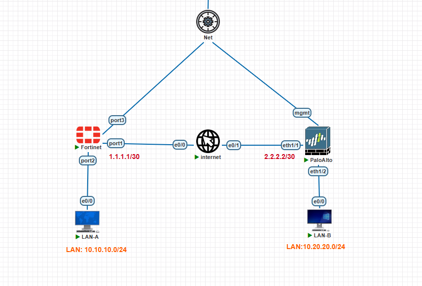

### Frontend (Tkinter)
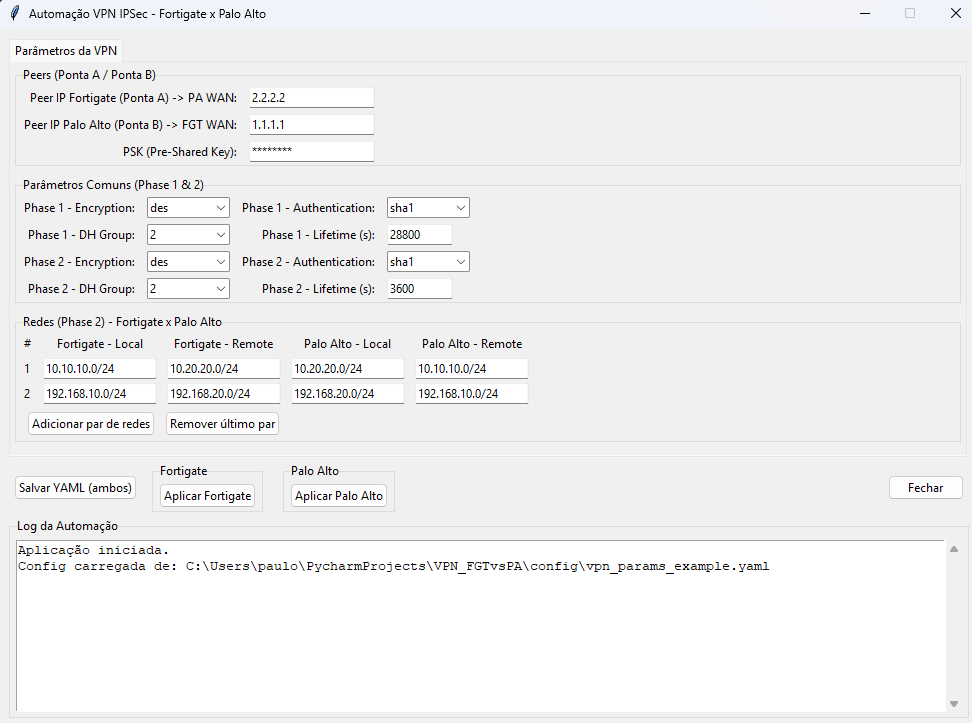

### Validação com alertas de sucesso - FORTIGATE
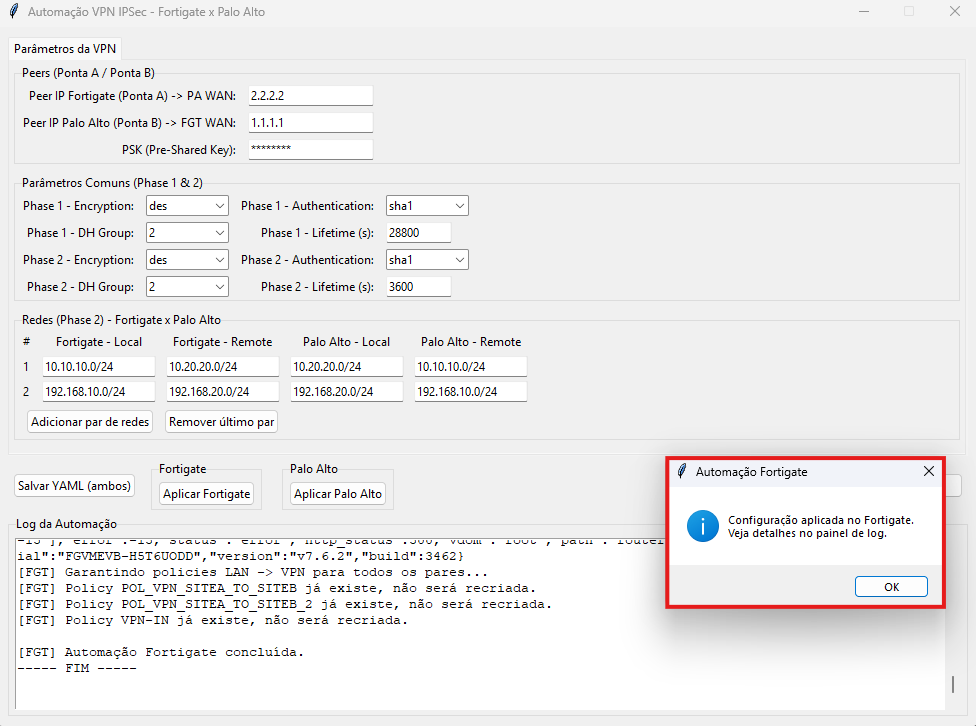

### Validação com alertas de sucesso - PALO ALTO
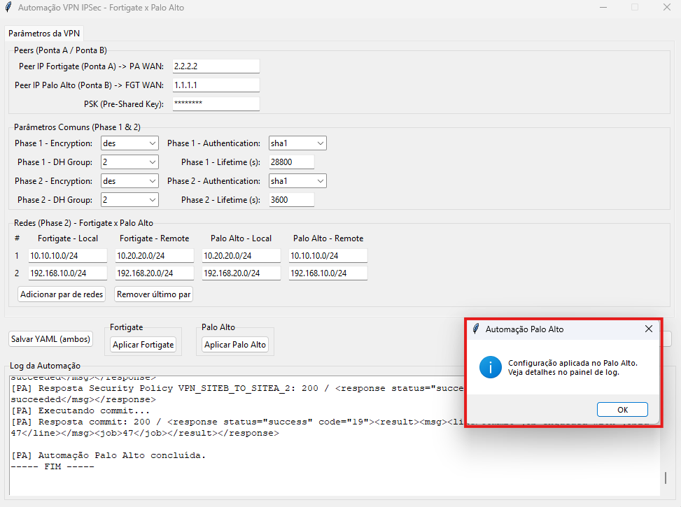

### Validação de Configurações VPN - FORTIGATE
- Criação de Rotas
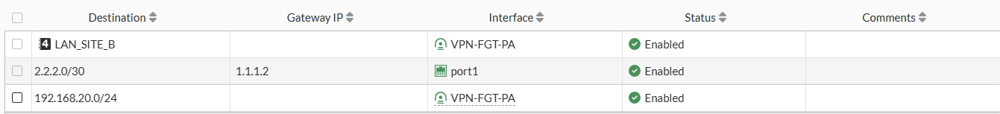
- Criação da VPN (Phase 1 e 2)
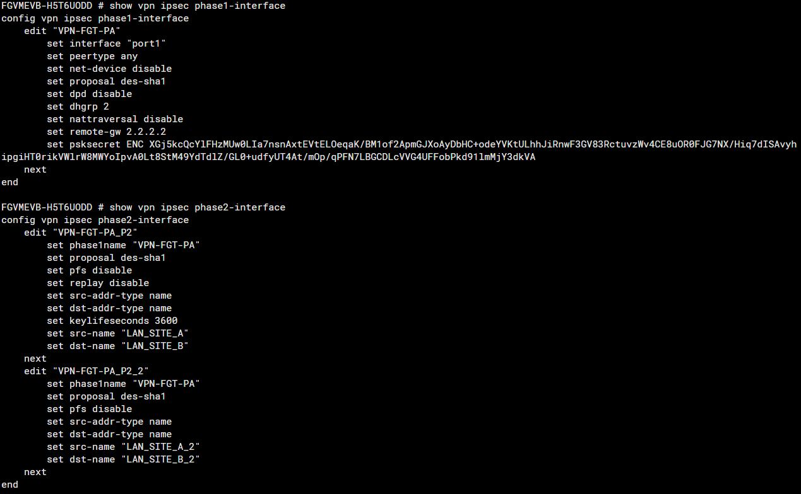
- Regra de Firewall
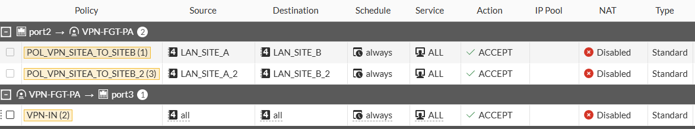
- VPN Status
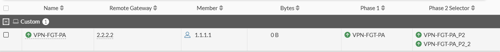

### Validação de Configurações VPN - PALO ALTO
- Criação de Rotas
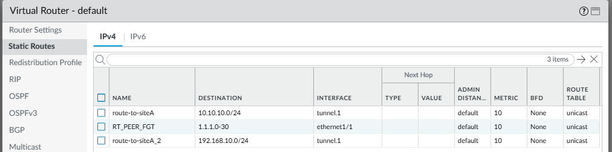
- Criação da VPN (Phase 1 e 2)
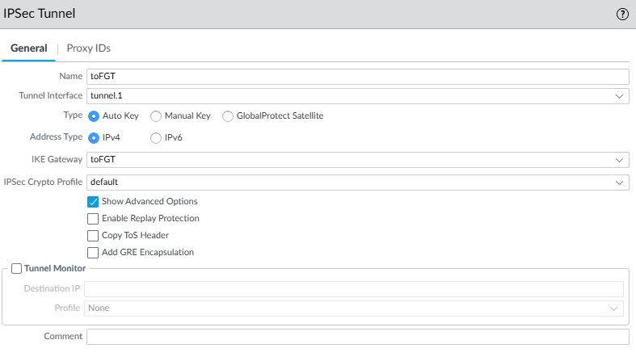
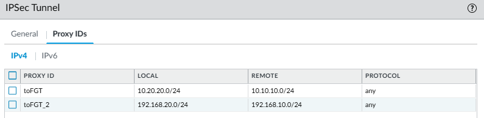
- Regra de Firewall
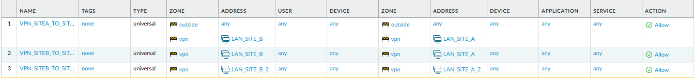
- VPN Status
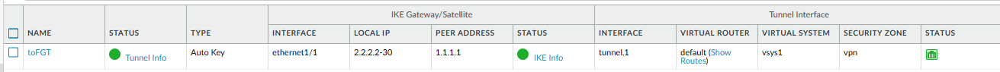


# 🏗 Estrutura do Projeto

```text
VPN_FGTvsPA/
│
├─ .venv/                     # Ambiente virtual (não versionado)
│
├─ backend/                   # Camada principal de automação
│  ├─ services/
│  │  ├─ fortigate_vpn.py     # Lógica de automação Fortigate
│  │  ├─ paloalto_vpn.py      # Lógica de automação Palo Alto
│  │  └─ connectivity_test.py # Testes de conectividade VPN
│  │
│  ├─ __init__.py
│  └─ main.py                 # Ponto de entrada backend
│
├─ config/                    # Arquivos YAML de configuração
│  ├─ interfaces_example.yaml
│  └─ vpn_params_example.yaml
│
├─ frontend/                  # Interface Web
│  ├─ index.html
│  └─ app.js
│
├─ scripts/                   # Scripts auxiliares e testes
│  ├─ configure_vpn_fortigate.py
│  ├─ configure_vpn_paloalto.py
│  ├─ test_pa_api.py
│  └─ test_vpn_connectivity.py
│
├─ docs/                      # Documentação técnica
│  ├─ plano-automacao-vpn-ipsec.md
│  └─ topologia-pnetlab.md
│
├─ old/                       # Arquivos antigos / versões anteriores
│
├─ app_tk.py                  # Interface Tkinter legada
├─ frontend_tk.py             # Frontend Tkinter alternativo
│
├─ requirements.txt
├─ test_yaml.py
├─ .gitignore
└─ README.md